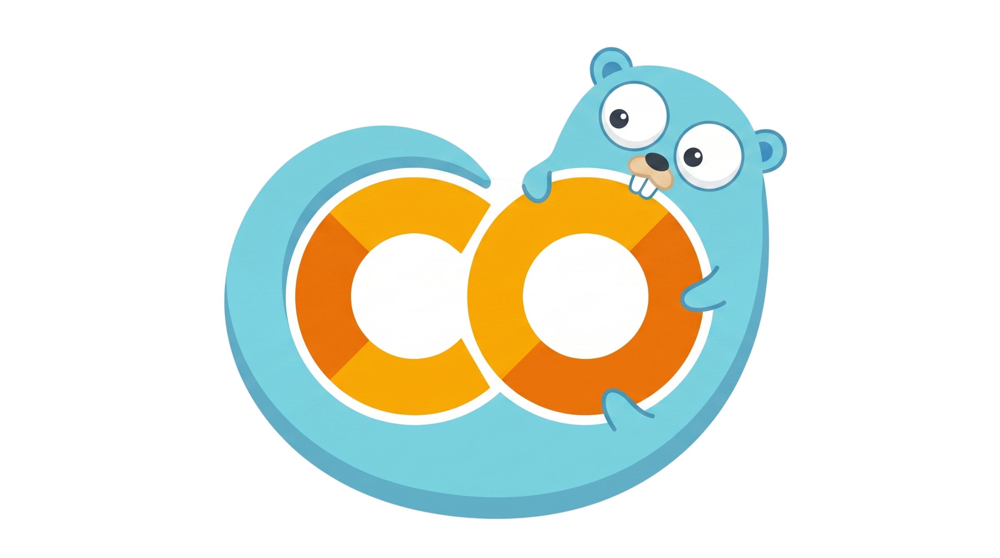

<div align="center">
  
  <h1>GoLab</h1>
  <p><b>Blazingly Fast, Native Golang MCP Server for Google Colab</b></p>

  [](https://opensource.org/licenses/Apache-2.0)
  [](https://golang.org/)
  []()
  []()
</div>

GoLab is a highly optimized, cross-platform server implementing the Model Context Protocol (MCP) for Google Colab. Written completely from scratch in Go, it serves as an independent, native alternative to the Python implementation. Wait no longer—bridge the gap between your local AI IDEs and remote Colab virtual machines instantly.

A major advantage of GoLab over the official Python implementation is its static tool architecture. **GoLab does not require complex client support for `notifications/tools/list_changed`**. This ensures guaranteed out-of-the-box compatibility with **all** standard MCP clients without dropping tools or enforcing strict dynamic listening requirements.

## ✨ Why GoLab?

- **Blazing Fast**: Written in compiled Go, offering near-zero overhead and immediate WebSocket communication.
- **Universal Compatibility**: Works fluently with Cursor, Claude Desktop, Gemini Code Assist, Windsurf, and Antigravity.
- **Cross-Platform**: Zero Python environment headaches. Seamless execution on Windows, macOS, and Linux.
- **Persistent Stability**: Employs static configurations ensuring safe browser reconnection without ephemeral token desyncs.

---

## 🚀 Quick Start

Getting started is identical whether you are running **macOS**, **Linux**, or **Windows**. By utilizing Go's module network, GoLab downloads and builds itself silently in the background.

**Prerequisite:** Ensure [Go (Golang)](https://go.dev/doc/install) is installed on your machine.

In your MCP client settings (e.g., Cursor, Claude Desktop, or Gemini Code Assist), you have three options to run the GoLab MCP server:

### Option 1: Live Cloud Module (Recommended)
If you have Go installed on your machine, you don't even need to download anything! You can command the AI to pull and execute the server directly from Github in one step:
```json
{
  "mcpServers": {
    "golab": {
      "command": "go",
      "args": ["run", "github.com/hoangnecon/golab/cmd/server@latest"],
      "env": {
        "COLAB_TOKEN": "replace-with-your-secure-token",
        "COLAB_WS_PORT": "9090",
        "GOPROXY": "direct"
      }
    }
  }
}
```

### Option 2: Pre-compiled Binary
Head over to the [Releases Tab](https://github.com/hoangnecon/golab/releases) and download the binary for your system (Windows, Mac, Linux).
```json
{
  "mcpServers": {
    "golab": {
      "command": "/absolute/path/to/downloaded/golab.exe",
      "env": {
        "COLAB_TOKEN": "replace-with-your-secure-token",
        "COLAB_WS_PORT": "9090"
      }
    }
  }
}
```

## ⚙️ Configuration Parameters

| Environment Variable | Description | Default |
|----------------------|-------------|---------|
| `COLAB_TOKEN` | (Required) A secret passcode of your choosing used to secure the WebSocket connection between your browser and your local agent. | `""` |
| `COLAB_WS_PORT` | (Optional) The local port used by the browser to communicate with GoLab. | `9090` |
| `GOPROXY` | (Optional) Set to `direct` when using `go run ... @latest` to bypass Go module cache and instantly receive updates. | `""` |
| `COLAB_BASE_URL` | (Optional) The Colab domain used when launching new notebook tabs from the IDE. | `colab.research.google.com` |

---

## 📓 Notebook Preparation & Drive Mounting

GoLab drives incredible automation natively, but it must adhere to Google Colab's strict security sandbox boundaries:

1. **Providing Notebook URLs**: When your AI Agent uses the `open_notebook` tool, it needs the direct Google Drive Colab File URL (e.g., `https://colab.research.google.com/drive/1YUds...`). GoLab will intercept this and automatically append the necessary MCP WebSocket mapping parameters.
2. **Mounting Google Drive**: If your workflow requires the AI agent to read/write files directly to Google Drive via the `list_drive` or `read_file` tools, **the user must manually mount Drive** inside the Colab UI first. You can do this in two ways:
   * **Method A (Native UI):** Click the "Folder" icon in the left sidebar of the Colab interface, then click the "Mount Drive" icon.
   * **Method B (Python Cell):** Execute the standard Drive mounting code:
     ```python
     from google.colab import drive
     drive.mount('/content/drive')
     ```
   *Note: Google strictly enforces an interactive OAuth consent popup for mounting Drive. The GoLab Agent cannot click "Accept" for you. Once mounted, the Agent has full native filesystem control.*

---

## 🧰 Available Tools Matrix

GoLab exposes **23 tools** to grant your AI comprehensive control over remote execution pipelines.

### Connection & Setup

| Tool | Description |
|------|-------------|
| **`check_status`** | Pings the WebSocket to verify if the frontend proxy is actively attached. |
| **`open_notebook`** | Opens a specified Colab or Drive URL, automatically injecting MCP parameters. |
| **`get_environment`** | Returns system info: Python version, CUDA version, GPU model, RAM, disk usage. |

### Notebook Reading

| Tool | Description |
|------|-------------|
| **`get_notebook_outline`** | Returns the full skeletal structure of the notebook (cell types, previews, definitions). |
| **`get_cells`** | Fetches the raw contents of specific cells by index range. |
| **`get_cell_with_lines`** | Returns a cell's content with line numbers for precise reference. |
| **`get_cell_output`** | Retrieves executed stdout, tracebacks, and image detection. |
| **`get_running_cells`** | Lists cells currently being executed, with elapsed time. |
| **`get_error_cells`** | Sweeps the notebook isolating kernel compilation or runtime failures. |
| **`search_cells`** | Searches for a text pattern across all cells with line-level context. |

### Cell Management

| Tool | Description |
|------|-------------|
| **`add_code_cell`** | Inserts a new Python code cell at a specified position. |
| **`add_text_cell`** | Inserts a new Markdown cell at a specified position. |
| **`update_cell`** | Complete overwrite of an existing cell's content. |
| **`delete_cell`** | Removes a target cell from the notebook. |
| **`move_cell`** | Moves a cell to a new index position in the notebook. |
| **`run_code_cell`** | Starts cell execution and returns immediately. Use `get_cell_output` to poll results. |

### Precision Editing

| Tool | Description |
|------|-------------|
| **`edit_cell_lines`** | Slice-and-replace specific lines within a cell without full overwrite. |
| **`insert_in_cell`** | Inject code at a specific line number, shifting existing code down. |
| **`find_replace_in_cell`** | String substitution within a single cell. |

### File I/O & Environment

| Tool | Description |
|------|-------------|
| **`read_file`** | Read text files from the Colab VM or mounted Google Drive. |
| **`write_file`** | Write content to files on the Colab VM or mounted Drive. |
| **`list_drive`** | List files and directories in Google Drive as a JSON tree. |
| **`check_package`** | Check if a specific Python package is installed and its version. |

---

## 📚 Concrete API Examples

Instead of prompting in natural language, here is exactly how your AI Agent and GoLab communicate payload schemas back-and-forth under the hood using the MCP Protocol:

### 1. Executing a Cell & Reading Output natively
**Agent Payload (`run_code_cell`)**:
```json
{
  "cellId": "jH5vSMErxJwI"
}
```
**GoLab Response**:
```json
{
  "outputs": [
    {
      "output_type": "stream",
      "name": "stdout",
      "text": ["Epoch 1/50 - loss: 0.4213\n"]
    }
  ]
}
```

### 2. Slicing Model Architecture Parameters Directly
**Agent Payload (`insert_in_cell`)**:
```json
{
  "cellId": "g24HDD5s9MNh",
  "lineNumber": 4,
  "content": "import torch\nimport torch.nn as nn"
}
```
**GoLab Response**:
```json
{
  "inserted": true,
  "linesInserted": 2,
  "totalLines": 15
}
```

---

## 🤝 Contributing & Issues

We welcome community contributions to make GoLab even better! 

1. Check the [Issues](https://github.com/hoangnecon/golab/issues) tab for existing reports or feature requests.
2. Fork the repository and create your feature branch.
3. Ensure your Go code is formatted (`go fmt`) and passes standard checks (`go vet`).
4. Submit a Pull Request with a clear description of your architectural changes.

---

## 📜 License

This project is an independent native Golang implementation. It is open-sourced under the [Apache License 2.0](LICENSE).
